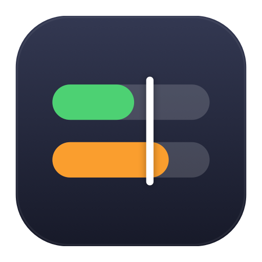
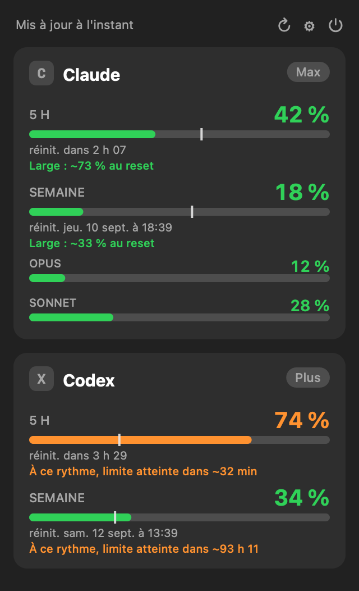

<div align="center">



# Pace

**Ta consommation Claude et OpenAI Codex, en un coup d'œil dans la barre de menu macOS.**

Sans clic, sans télémétrie, sans dépendance. Un curseur de rythme te dit quand lever le pied.


</div>

---

## Aperçu

Pace affiche deux blocs compacts dans la barre de menu :

```
C 42% · 18%   X 74% · 34%
```

`C` = Claude, `X` = Codex. Premier pourcentage = fenêtre 5 h, second = fenêtre
hebdo. La couleur suit la valeur : vert sous 60 %, orange de 60 à 85 %, rouge
au-delà, gris si la donnée est indisponible. Un clic ouvre le détail.

<div align="center">
<picture>
  <source media="(prefers-color-scheme: dark)" srcset="docs/img/popover.png">
  <source media="(prefers-color-scheme: light)" srcset="docs/img/popover-light.png">
  
</picture>
</div>

## Fonctionnalités

- **Deux providers, un coup d'œil** : Claude (abonnement claude.ai) et OpenAI
  Codex côte à côte, fenêtre 5 h et hebdo.
- **Curseur de rythme** : un repère sur chaque barre marque le temps écoulé dans
  la fenêtre. Si la barre le dépasse, tu consommes plus vite que le temps ne
  passe, avec une phrase du type « à ce rythme, limite atteinte dans ~32 min ».
  Sinon, « large : ~X % au reset ».
- **Détail par modèle** : Opus, Sonnet, Fable… quand l'API les renvoie, plus
  l'extra usage et les crédits s'ils existent.
- **Surveillance de panne** : les pages de statut d'Anthropic et d'OpenAI sont
  suivies ; un bandeau apparaît si un composant Claude ou Codex est perturbé.
- **Notifications** aux seuils que tu choisis, distincts pour la 5 h et l'hebdo,
  réarmées à chaque reset.
- **Réglable** : par provider, choisis ce que la barre affiche (5 h, hebdo, ou
  les deux). Intervalle de refresh, seuils, lancement au démarrage.
- **Démarrage instantané** : le dernier usage connu est mis en cache localement
  (pourcentages et dates, jamais de token).
- **Respectueux** : secrets dans le Trousseau uniquement, aucune télémétrie,
  seuls les endpoints nécessaires sont contactés.

## Prérequis

- macOS 14 (Sonoma) ou plus récent, Apple Silicon.
- Au moins l'un des deux, connecté sur ta machine :
  - **Claude Code** (`claude`), pour lire l'usage Claude sans rien saisir.
  - **Codex CLI** (`codex login`), pour l'usage Codex.

Si Claude Code n'est pas installé, tu peux coller une **session key claude.ai**
dans les réglages (mode secours).

## Installation

### Depuis une release

1. Télécharge le `.dmg` depuis la [page des releases](https://github.com/pkcoulon/pace/releases).
2. Ouvre-le et glisse **Pace** dans Applications.

L'app n'est pas notarisée par Apple (voir plus bas). Au premier lancement,
macOS peut afficher « impossible de vérifier le développeur ». Deux façons de
lever l'avertissement :

- Réglages Système → Confidentialité et sécurité → **« Ouvrir quand même »**.
- Ou en une commande :
  ```sh
  xattr -dr com.apple.quarantine /Applications/Pace.app
  ```

### Depuis les sources

```sh
git clone https://github.com/pkcoulon/pace.git
cd pace
make app                     # compile et assemble build/Pace.app
cp -R build/Pace.app /Applications/
```

Compilé localement, le `.app` n'a pas de quarantaine : aucun avertissement.

## Utilisation

- **Barre de menu** : deux blocs compacts, couleur par valeur. Certains plans
  Codex n'ont pas de fenêtre 5 h ; la barre affiche alors seulement l'hebdo.
- **Popover** (clic) : une carte par provider, barres 5 h et hebdo avec curseur
  de rythme, compte à rebours, date de reset, lignes par modèle. Les actions
  (rafraîchir, réglages, quitter) sont en haut à droite. Cliquer une carte ouvre
  la page d'usage officielle du provider.
- **Réglages** : providers actifs, contenu de la barre par provider, affichage
  du rythme, intervalle de refresh (1 / 3 / 5 min), seuils de notification
  distincts 5 h / hebdo, lancer au démarrage, et la session key Claude de secours
  avec bouton Tester.

## Confidentialité et réseau

Pace ne contacte que les hôtes strictement nécessaires, aucune télémétrie,
aucun analytics :

| Hôte | Quand |
|---|---|
| `api.anthropic.com` | usage Claude (mode principal) |
| `chatgpt.com` | usage Codex |
| `auth.openai.com` | seulement quand le token Codex a plus de 8 jours |
| `claude.ai` | seulement en mode secours session key |
| `status.claude.com` | surveillance de panne Claude (toutes les 5 min) |
| `status.openai.com` | surveillance de panne Codex (toutes les 5 min) |

Aucun token n'est écrit en clair sur disque ni journalisé. Pour le vérifier :

```sh
sudo lsof -i -nP | grep -i pace     # les connexions ouvertes par le processus
```

Un pare-feu applicatif (Little Snitch, LuLu) confirmera que seuls les hôtes
ci-dessus apparaissent.

### Comment les comptes sont lus

**Claude.** Le token OAuth déposé par Claude Code est lu dans le Trousseau
macOS (entrée `Claude Code-credentials`) via `/usr/bin/security`, sans jamais
déclencher de dialogue d'autorisation. L'usage vient de
`GET https://api.anthropic.com/api/oauth/usage`. Pace ne rafraîchit jamais ce
token : sur un 401, le popover affiche « relance `claude` ». En secours, une
session key claude.ai stockée au Trousseau interroge `claude.ai/api`.

**Codex.** Le token est lu dans `~/.codex/auth.json`. L'usage vient de
`GET https://chatgpt.com/backend-api/wham/usage`. Au-delà de 8 jours, le token
est rafraîchi via `auth.openai.com`, et `auth.json` réécrit de façon atomique
en `0600`.

## Développement

```sh
swift build                  # binaire de debug dans .build/
make app                     # bundle .app signé ad hoc
make run                     # (re)compile et relance
```

Structure : `Sources/Pace/{Models,Services,Stores,Views}`. Un provider par
source derrière le protocole `UsageProvider`, stores `ObservableObject`, vues
SwiftUI. Zéro dépendance externe.

Régénérer l'icône : `Scripts/make-icon.sh`.

## Signature et notarisation (mainteneurs)

Pour une identité stable qui évite que macOS redemande les autorisations à
chaque build :

```sh
SIGN_IDENTITY="Developer ID Application: Ton Nom (TEAMID)" make app
```

Pour distribuer un `.dmg` sans avertissement Gatekeeper, il faut un certificat
**Developer ID Application** et une notarisation Apple. Une fois le certificat
créé et un profil `notarytool` enregistré, `Scripts/notarize.sh` signe en
hardened runtime, soumet et agrafe le `.dmg`. Les prérequis sont détaillés en
tête du script.

## Crédits

Pace reproduit les approches d'authentification et d'API étudiées dans trois
projets ; merci à leurs auteurs :

- [AThevon/TokenEater](https://github.com/AThevon/TokenEater) — lecture du token
  Claude Code dans le Trousseau.
- [hamed-elfayome/Claude-Usage-Tracker](https://github.com/hamed-elfayome/Claude-Usage-Tracker)
  — auth Codex via `~/.codex/auth.json` et refresh de token (lui-même inspiré de
  [steipete/codexbar](https://github.com/steipete/codexbar), MIT).
- [f-is-h/usage4claude](https://github.com/f-is-h/usage4claude) — session key
  claude.ai en mode secours.

## Licence

MIT. Voir [LICENSE](LICENSE).
