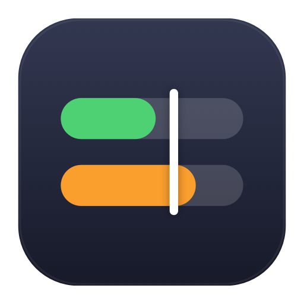
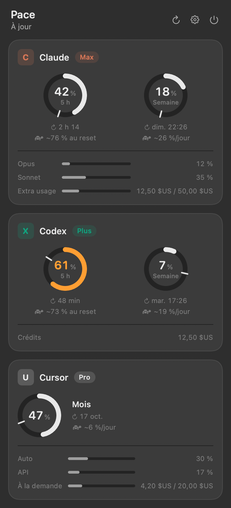

<div align="center">



# Pace

**Tes quotas Claude, Codex, Copilot, Cursor, z.ai et OpenRouter, dans la barre de menu macOS.**

Sans clic, sans télémétrie, sans dépendance.


</div>

---

Une lettre par connecteur (`C` Claude, `X` Codex, `G` Copilot, `U` Cursor,
`Z` z.ai, `O` OpenRouter), puis la fenêtre courte (5 h) et/ou longue (semaine,
mois). Les valeurs restent neutres et passent en orange puis en rouge près de
la limite. Un clic ouvre le détail.

<div align="center">

</div>

## Fonctionnalités

- Six connecteurs, activés d'office quand l'outil est déjà sur le Mac. Une
  jauge par fenêtre, détail par modèle, crédits ou dépassement.
- **Rythme** : une coche sur la jauge marque le temps écoulé. Sur la fenêtre
  courte, la projection suit ta dernière heure (« limite dans ~32 min ») et une
  courbe retrace le cycle ; sur la longue, un budget par jour (« ~16 %/jour »).
- Barre de menu en trois styles : texte, anneaux ou compact (la pire valeur
  seule). À 100 %, le compte à rebours du reset remplace la valeur (`↻23m`).
- Notifications aux seuils choisis (fenêtre courte / longue), alerte si la
  limite tombe dans l'heure, notification au reset.
- Bandeau de panne (Claude, Codex, Copilot, Cursor), données périmées signalées.
- Démarrage instantané via cache local, rafraîchi au réveil du Mac.
- Export JSON pour tes scripts, vérification de mise à jour au choix.
- Interface en français ou en anglais, selon la langue du Mac.
- Secrets dans le Trousseau, aucun appel réseau superflu.

## Prérequis

macOS 14+, Apple Silicon. Puis, pour chaque connecteur voulu :

| Connecteur | Connexion |
|---|---|
| Claude | Claude Code connecté (`claude`), sinon une session key claude.ai |
| Codex | `codex login` |
| Copilot | `gh auth login`, ou Copilot connecté dans ton éditeur |
| Cursor | session ouverte dans l'app Cursor |
| z.ai | clé API collée dans les réglages, ou Claude Code configuré sur z.ai |
| OpenRouter | clé collée dans les réglages (jauge si la clé a une limite) |

## Installation

Télécharge le `.dmg` de la [dernière release](https://github.com/pkcoulon/pace/releases)
et glisse **Pace** dans Applications. L'app est signée Developer ID et
notarisée : elle s'ouvre sans avertissement.

Depuis les sources :

```sh
git clone https://github.com/pkcoulon/pace.git && cd pace
make app && cp -R build/Pace.app /Applications/
```

## Intégrations

Après chaque rafraîchissement, Pace écrit
`~/Library/Application Support/Pace/usage.json` (désactivable dans Réglages >
Général). Seuls les connecteurs activés y figurent, toute clé est présente
(`null` si vide) :

```json
{
  "version": 1,
  "updatedAt": "2026-10-08T10:00:00.000Z",
  "providers": {
    "claude": {
      "name": "Claude", "plan": "Max", "source": "Claude Code",
      "fetchedAt": "2026-10-08T09:59:58.000Z", "stale": false, "error": null,
      "short": { "label": "5 h", "percent": 42, "resetsAt": "2026-10-08T12:00:00.000Z",
                 "pace": { "level": "comfortable", "projected": 73.6,
                           "timeToLimitSeconds": null, "dailyBudget": null } },
      "long": { "label": "Semaine", "percent": 18, "resetsAt": "2026-10-12T08:00:00.000Z",
                "pace": { "level": "comfortable", "projected": 42,
                          "timeToLimitSeconds": null, "dailyBudget": 20.9 } }
    }
  }
}
```

Pour la statusline de Claude Code ou tmux :

```sh
jq -r '[.providers[] | (.short // .long) as $w | select($w) | "\(.name) \($w.percent)%"] | join(" · ")' ~/Library/Application\ Support/Pace/usage.json
```

## Confidentialité

Aucun token n'est écrit en clair ni journalisé. Seuls ces hôtes sont contactés,
et uniquement pour les connecteurs activés :

| Hôte | Quand |
|---|---|
| `api.anthropic.com` | usage Claude |
| `claude.ai` | mode secours session key |
| `chatgpt.com` | usage Codex |
| `auth.openai.com` | refresh du token Codex (> 8 jours) |
| `api.github.com` | usage Copilot ; vérification de mise à jour si activée (1 fois par jour au plus) |
| `api2.cursor.sh` | usage Cursor |
| `api.z.ai` | usage z.ai (ou `open.bigmodel.cn`, `dev.bigmodel.cn` si Claude Code y pointe) |
| `openrouter.ai` | usage OpenRouter |
| `status.claude.com`, `status.openai.com`, `www.githubstatus.com`, `status.cursor.com` | surveillance de panne |

Les identifiants sont lus là où les outils les rangent déjà : Trousseau,
`~/.codex/auth.json`, `~/.config/gh` et `~/.config/github-copilot`, la base
locale de Cursor (lecture seule), `~/.claude/settings.json` pour z.ai. Les clés
collées dans Pace vont au Trousseau.

## Crédits

Approches d'auth étudiées dans [TokenEater](https://github.com/AThevon/TokenEater),
[Claude-Usage-Tracker](https://github.com/hamed-elfayome/Claude-Usage-Tracker)
(d'après [codexbar](https://github.com/steipete/codexbar)) et
[usage4claude](https://github.com/f-is-h/usage4claude). Formats des connecteurs
Copilot, Cursor, z.ai et OpenRouter recoupés avec
[openusage](https://github.com/robinebers/openusage), codexbar et les
[plugins z.ai](https://github.com/zai-org/zai-coding-plugins).

## Licence

[MIT](LICENSE).
